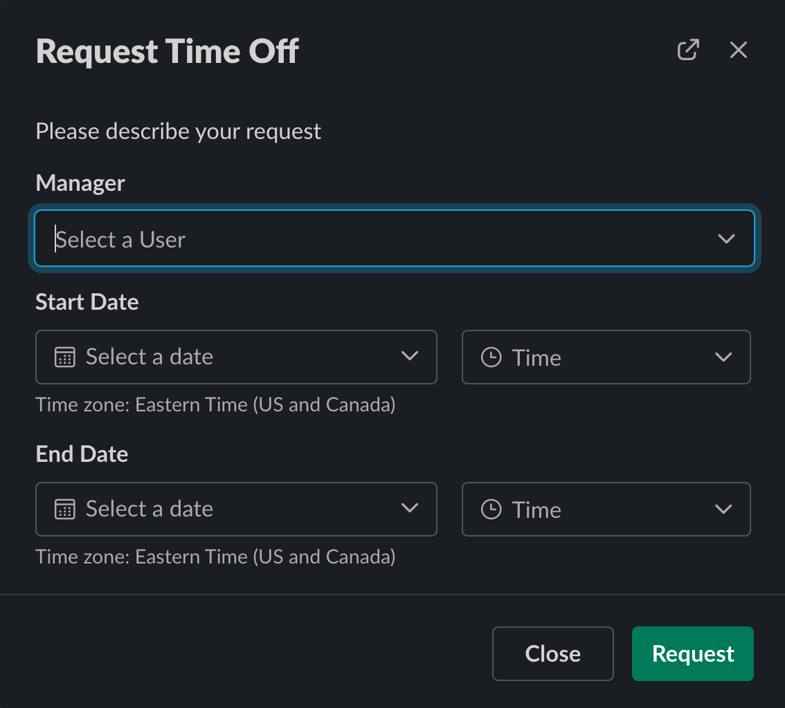
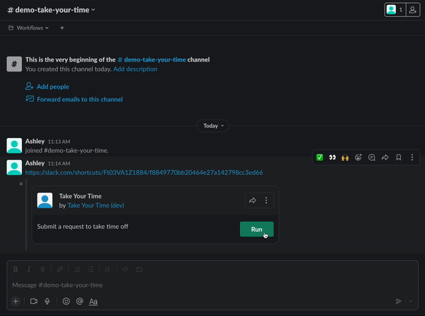
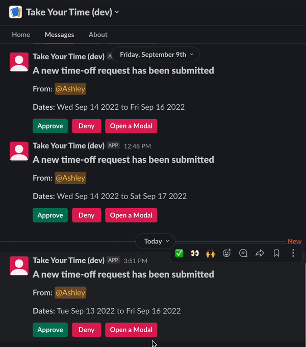
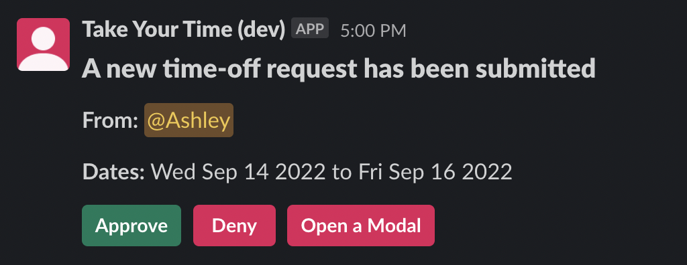
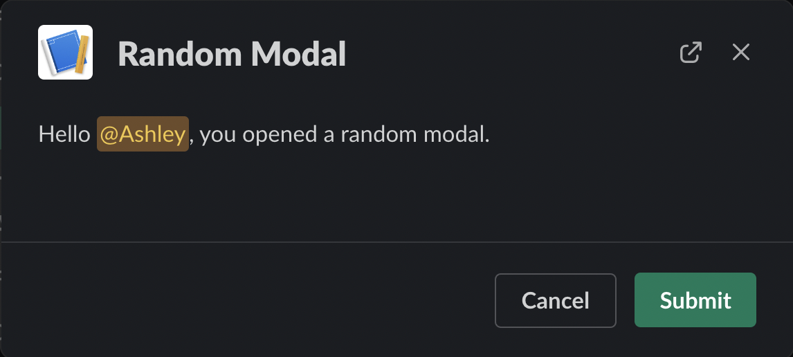

# Create a new app <span class="label-beta">BETA</span>

<div class="section-content">
This guide will walk you through getting started with the Slack CLI as well as how to create a new app in the CLI with Bolt JS. If you already have a Bolt JS application built that you'd like to migrate to the new [next-generation platform](/bolt-js/future/getting-started#next-gen), please follow the [Migration guide](/bolt-js/future/migrate-existing-app).

The application built in this tutorial will be a "Request Time Off" app that allows a user to submit requests for time off, which then sends a message to their manager, who can either approve or deny the request.
</div>

When you’re finished, you’ll have this ⚡️[Bolt JS Request Time Off app](https://github.com/slack-samples/bolt-js-request-time-off) to run, modify, and make your own.

If you have an existing Bolt JS application that you are looking to migrate to the next-generation platform experience, check out the [Migration Guide](/bolt-js/future/migrate-existing-app).

---
### Prerequisites {#prerequisites}
In order to create your app, make sure you've first followed the steps to install all dependencies in the [Getting Started guide](/bolt-js/future/getting-started).

---

### Create an app {#create-an-app}
Before you start developing with Bolt, you'll want to create a Slack app. 

To create the app, you'll run the following command:
```
slack create my-app -t slack-samples/bolt-js-request-time-off
```
This command creates an app through the CLI using a template. In this case, it's using the Bolt JS Request Time Off application which can be found [here](https://github.com/slack-samples/bolt-js-request-time-off). 

The application will take a few moments to set up. Once the app is successfully created, you should see a message like this:
```
✨ my-app successfully created

🧭 Explore your project's README.md for documentation and code samples, and at any time run hermes help to display a list of available commands

🧑‍🚀 Follow the steps below to try out your new project

1️⃣  Change into your project directory with: cd my-app

2️⃣  Develop locally and see changes in real-time with: slack run

3️⃣  When you're ready to deploy for production use: slack deploy

🔔 If you leave the workspace, you won’t be able to manage any apps you’ve deployed to it. Apps you deploy will belong to the workspace even if you leave the workspace
```

You can now explore the `my-app` directory!

---
### Set up your trigger {#setup-trigger}
In order to utilize the pre-existing functionality in the Request Time Off app, you'll need to create a trigger prior to running your app. Enter the project directory: `cd my-app`

Then, run the following command to create a trigger using the `link-shortcut.json` configuration file that initializes your trigger:
```
slack triggers create --trigger-def "triggers/link-shortcut.json"      
```

The above command will create a trigger for the selected workspace. Once the trigger is successfully created, you should see an output like this:
```
⚡ Trigger created
   Trigger ID:   [ID]
   Trigger Type: shortcut
   Trigger Name: Take Your Time
   URL: https://slack.com/shortcuts/[ID]/[Some ID]
```
The URL will be what you use to run your trigger. To make the trigger accessible, you can paste the link trigger URL in a channel or conversation. We recommend saving the trigger as a channel bookmark for easy access.

---
### Run your app {#run-your-app}
Now that your app and trigger are successfully created, let's try running it!

Run `slack run` to start up the app. Executing `slack run` starts a local development server, syncing changes to your workspace's development version of your app.

You'll be prompted to select a workspace to install the app to - select the development instance of your workspace (you'll know it's the development version because the name has the string `(dev`) appended). If you don't see the workspace you'd like to use in the list, you can run `slack auth login` and authenticate in the desired workspace to have it show up.

Once the app is successfully run, you'll see output in your Terminal to indicate it's running similar to what you would see with any other Bolt JS app. You can search for the `⚡️ Bolt app is running! ⚡️` message to indicate that your app has successfully started up.

With your app running, access your workspace and paste the URL from your trigger into a public channel. Click the "Run" button that appears and a modal will appear prompting you to enter information to request time off. To test your app properly, we recommend entering your own Slack username in the "Manager" field.



Then, submit the form. You should receive a message from the app with information about the requested time off as well as an "Approve" and "Deny" button. Once either button is selected, you should then receive a message from the app notifying you of the status of your request.

The full app flow can be seen here:


---
### Workflows {#workflows}

Then, we can work backwards to identify the workflow and how it's declared.

Workflows are a set of processing steps that are executed in order. Every workflow step consists of either a [built-in function](/bolt-js/future/built-in-functions) or [custom function](/bolt-js/future/custom-functions). Workflows can be configured to run without any user input, or they can wait for input via form before continuing.

In the Request Time Off application, the Time Off Request workflow is defined in `manifest/workflow/time-off-request.js`. The general structure of a workflow is to first define it using the built in function `DefineWorkflow`:

```js
const { DefineWorkflow, Schema } = require('@slack/bolt');

const TimeOffWorkflow = DefineWorkflow({
  callback_id: 'time_off_request_wf',
  title: 'Time Off Request Workflow',
  input_parameters: {
    properties: {
      interactivity: {
        type: Schema.slack.types.interactivity,
      },
    },
    required: [],
  },
});

module.exports = { TimeOffWorkflow };
```

In order to create a workflow that utilizes user input, such as a form, you'll need to pass in `interactivity` as one of the workflow's `input_parameters` under `properties`. This will allow the form to be interacted with.

Now that the workflow has been defined, you can start adding steps underneath the definition, which will execute additional functionality in your workflow. Steps are executed in the order they appear. For the Time Off Request workflow, the first step will be a form that will allow the user to enter in their time off request.

```js
const step1 = TimeOffWorkflow.addStep(
  Schema.slack.functions.OpenForm,
  {
    title: 'Request Time Off',
    submit_label: 'Request',
    description: 'Please describe your request',
    interactivity: TimeOffWorkflow.inputs.interactivity,
    fields: {
      required: ['manager', 'start_date', 'end_date'],
      elements: [
        {
          name: 'manager',
          title: 'Manager',
          type: Schema.slack.types.user_id,
        },
        {
          name: 'start_date',
          title: 'Start Date',
          type: Schema.slack.types.timestamp,
        },
        {
          name: 'end_date',
          title: 'End Date',
          type: Schema.slack.types.timestamp,
        },
      ],
    },
  },
);
```
This step uses the built-in function [OpenForm](https://api.slack.com/future/functions#open-a-form) and initializes expected inputs of the form, which are defined by [Slack types](https://api.slack.com/future/types) such as `timestamp` to indicate dates. The Time Off Request form contains a `manager`, `start_date`, and `end_date` field, all of which are required inputs to submit the form.

After the form is submitted, another workflow step can be added to handle the information that was submitted in this form. For the Time Off Request workflow, after the requester submits the request, it should send a message to the manager to notify them of the request and allowing them to approve or deny request through the message. Since this functionality does not exist as a built-in function, it requires a custom function, which we'll call `ApprovalFunction`, in order to execute the desired functionality:

```js
TimeOffWorkflow.addStep(ApprovalFunction, {
  employee: TimeOffWorkflow.inputs.interactivity.interactor.id,
  manager: step1.outputs.fields.manager,
  start_date: step1.outputs.fields.start_date,
  end_date: step1.outputs.fields.end_date,
});
```

This step passes in the `ApprovalFunction` as well as inputs from the form in the first workflow step: `manager`, `start_date`, and `end_date`. It also passes in the `employee` ID by using the `interactivity` property's `interactor` ID, which comes from the initial definition of the `TimeOffWorkflow`.

Once the function step is executed, that will be the end of the workflow! All remaining functionality, such as notifying the requester whether their request was approved or denied, will be executed using the `ApprovalFunction` and its related action handlers. The `ApprovalFunction` will be defined below in the [Functions](#functions) section.

The final workflow file will look like this:
```js
const { DefineWorkflow, Schema } = require('@slack/bolt');
const { ApprovalFunction } = require('../function/approval');

const TimeOffWorkflow = DefineWorkflow({
  callback_id: 'time_off_request_wf',
  title: 'Time Off Request Workflow',
  input_parameters: {
    properties: {
      interactivity: {
        type: Schema.slack.types.interactivity,
      },
    },
    required: [],
  },
});

const step1 = TimeOffWorkflow.addStep(
  Schema.slack.functions.OpenForm,
  {
    title: 'Request Time Off',
    submit_label: 'Request',
    description: 'Please describe your request',
    interactivity: TimeOffWorkflow.inputs.interactivity,
    fields: {
      required: ['manager', 'start_date', 'end_date'],
      elements: [
        {
          name: 'manager',
          title: 'Manager',
          type: Schema.slack.types.user_id,
        },
        {
          name: 'start_date',
          title: 'Start Date',
          type: Schema.slack.types.timestamp,
        },
        {
          name: 'end_date',
          title: 'End Date',
          type: Schema.slack.types.timestamp,
        },
      ],
    },
  },
);

TimeOffWorkflow.addStep(ApprovalFunction, {
  employee: TimeOffWorkflow.inputs.interactivity.interactor.id,
  manager: step1.outputs.fields.manager,
  start_date: step1.outputs.fields.start_date,
  end_date: step1.outputs.fields.end_date,
});

module.exports = { TimeOffWorkflow };
```

To explore more about Workflows and dive into creating new ones, visit the guide [here](/bolt-js/future/workflows).

---
### Triggers {#triggers}

Workflows are invoked by triggers. To allow for the Time Off Request workflow to be executed in a workspace, you'll need to create a trigger. Slack supports many different kinds of triggers, and for this application, we will use a [link trigger](https://api.slack.com/future/triggers/link). The definition for this link trigger is a JSON config file which can be found in `triggers/link-shortcut.json`.

The `link-shortcut.json` file looks like this:
```json
{
  "type": "shortcut",
  "name": "Take Your Time",
  "description": "Submit a request to take time off",
  "workflow": "#/manifest/workflow/time_off_request_wf",
  "shortcut": {},
  "inputs": {
    "interactivity": {
      "value": "{{data.interactivity}}"
    }
  }
}
```
This file acts as a config for your trigger that specifies which workflow is executed when the trigger is invoked (in this case, it maps the workflow to the `time_off_request_wf` callback ID from the Time Off Request Workflow initialized in `/manifest/workflow/time-off-request.js`).

This file will also define how the trigger shows up in your application - for example, the `name` field will be the name of the trigger when it is surfaced as a link trigger in your workspace.

In [Set up your trigger](#setup-trigger), you ran a command, `slack triggers create --trigger-def "triggers/link-shortcut.json"`. This created a link trigger connected to the Time Off Request workflow and generated a URL, which can be used to run the trigger in your workspace. You can either paste the link into a message and click on it to launch the trigger or add the URL as a link bookmark in a channel to create an easy way to run the trigger. In order to run the trigger to launch the full workflow, your application must be running via `slack run`.

To learn more about Triggers and create new ones, visit the guide [here](/bolt-js/future/triggers).

---
### Functions {#functions}
Functions are building blocks of automation that accept inputs, perform some calculations, and provide outputs. Functions can be used as steps in Workflows. There are two types of functions: [built-in functions](/bolt-js/future/built-in-functions), which are Slack native actions defined in the Schema, such as sending messages, and [custom functions](/bolt-js/future/custom-functions), which are not built-in and are defined by the developer.

In the Request Time Off application, we use one custom function, `ApprovalFunction`, which we passed into our Time Off Workflow as the second step after a requester submits time off information. At this point, our custom function will take that information and then send it to the manager to approve or deny.

Our `ApprovalFunction` is defined in `manifest/function/approval.js`. Custom functions are defined using `DefineFunction`.
```js
const { DefineFunction, Schema } = require('@slack/bolt');

const ApprovalFunction = DefineFunction({
  callback_id: 'review_approval',
  title: 'Approval Function',
  description: 'Get approval for a request',
  input_parameters: {
    properties: {
      employee: {
        type: Schema.slack.types.user_id,
        description: 'Requester',
      },
      manager: {
        type: Schema.slack.types.user_id,
        description: 'Manager',
      },
      start_date: {
        type: Schema.slack.types.timestamp,
        description: 'Start Date',
      },
      end_date: {
        type: Schema.slack.types.timestamp,
        description: 'End Date',
      },
    },
    required: [
      'employee',
      'manager',
      'start_date',
      'end_date',
    ],
  },
  output_parameters: {
    properties: {},
    required: [],
  },
});

module.exports = { ApprovalFunction };
```
Within `ApprovalFunction`'s definition, we are declaring expected input and output parameters as well as adding some metadata about our function, like a `title` and `description`. Parameters for the function are typed using [types from Slack's schema](https://api.slack.com/future/types), such as `user_id` for the `employee` parameter. This indicates that it expects a type of `user_id` for the `employee` value that is passed in.

Once the function is defined, we need to create a listener for it to perform any desired functionality - in this case, our desired functionality is to send the inputted manager the time off request as a message.

The function listener is declared in `listeners/functions/request-approval.js`:
```js
// For more information about functions: https://api.slack.com/future/functions
const { SlackFunction } = require('@slack/bolt');

// Get our Approval Function from the manifest!
const { ApprovalFunction } = require('../../manifest/function/approval');

// Here is the work we want to do!
const notifyApprover = async ({ event, client, complete }) => {
  const { manager, employee, end_date, start_date } = event.inputs;
  const startDate = new Date(start_date * 1000).toDateString();
  const endDate = new Date(end_date * 1000).toDateString();

  try {
    await client.chat.postMessage({
      channel: manager,
      text: 'A new time-off request has been submitted.',
      blocks: [
        {
          type: 'header',
          text: {
            type: 'plain_text',
            text: 'A new time-off request has been submitted',
          },
        },
        {
          type: 'section',
          text: {
            type: 'mrkdwn',
            text: `*From:* <@${employee}>`,
          },
        },
        {
          type: 'section',
          text: {
            type: 'mrkdwn',
            text: `*Dates:* ${startDate} to ${endDate}`,
          },
        },
        {
          type: 'actions',
          block_id: 'approve-deny-buttons',
          elements: [
            {
              type: 'button',
              text: {
                type: 'plain_text',
                text: 'Approve',
              },
              action_id: 'approve_request',
              style: 'primary',
            },
            {
              type: 'button',
              text: {
                type: 'plain_text',
                text: 'Deny',
              },
              action_id: 'deny_request',
              style: 'danger',
            },
          ],
        },
      ],
    });
  } catch (err) {
    // Complete function with an error
    await complete({ error: `There was an issue: ${err}` });
    throw (err);
  }
};

// Let's register a new Slack Function with notifyApprover as its handler
const requestApprovalFunc = new SlackFunction(ApprovalFunction.id, notifyApprover);

module.exports = { requestApprovalFunc };
```

In the `request-approval.js` file, we are defining a handler function, `notifyApprover`, that our listener will trigger when the `ApprovalFunction` is invoked. `notifyApprover` takes in the provided parameters from the function and calls `client.chat.postMessage` to send a [Block Kit](https://api.slack.com/block-kit) message with the submitted time off information to the manager. Additional buttons to approve or deny the request are also added in to the message - these will be handled by [Action](#action) handlers that are covered in the next section.

This `notifyApprover` handler function is then passed in to a new `SlackFunction` registration so that it will be called when the `ApprovalFunction is invoked.

Although the function listener has been declared, we now need to register the listener in the application. This is done in `listeners/functions/index.js`:
```js
const { requestApprovalFunc } = require('./request-approval');

// Register a complete function
module.exports.register = (app) => {
  app.function(requestApprovalFunc);
  // Register another function here
};
```

To learn more about custom functions, you can view the documentation [here](/bolt-js/future/custom-functions).

---
### Actions {#actions}
Now that our function listener has been initialized and registered, we can add in [action handlers](/bolt-js/concepts#action-listening) for our approve and deny buttons in the message sent to the manager.

The action handlers will carry out the remaining functionality in the app, which will be to hide the approve and deny buttons once one is selected by the manager and send a message to the requester notifying them whether their time off has been approved.

We have two different handlers, one for each potential action - an Approval Action (found in `listeners/functions/actions/approve-action.js`) and a Deny Action (found in `listeners/functions/actions/deny-action.js`). Both Actions look very similar because they handle similar functionality, with the main difference being the messages surfaced to the manager and user after approving or denying.

The Approval Action looks like this:
```js
const approveActionHandler = async ({ ack, client, body, complete }) => {
  const { manager, employee, start_date, end_date } = body.function_data.inputs;
  const { channel_id, message_ts } = body.container;
  const startDate = new Date(start_date * 1000).toDateString();
  const endDate = new Date(end_date * 1000).toDateString();

  try {
    await ack();
    await client.chat.postMessage({
      channel: employee,
      text: `:white_check_mark: Time-off request for ${startDate} to ${endDate} approved by <@${manager}>`,
      blocks: [{
        type: 'context',
        elements: [
          {
            type: 'mrkdwn',
            text: `:white_check_mark: Time-off request for ${startDate} to ${endDate} approved by <@${manager}>`,
          },
        ],
      }],
    });

    // Update the manager's message to remove the buttons and reflect the approval state.
    await client.chat.update({
      channel: channel_id,
      ts: message_ts,
      text: 'A new time-off request has been submitted.',
      blocks: [
        {
          type: 'header',
          text: {
            type: 'plain_text',
            text: 'A new time-off request has been submitted',
          },
        },
        {
          type: 'section',
          text: {
            type: 'mrkdwn',
            text: `*From:* <@${employee}>`,
          },
        },
        {
          type: 'section',
          text: {
            type: 'mrkdwn',
            text: `*Dates:* ${startDate} to ${endDate}`,
          },
        },
      ],
    });
    complete();
  } catch (error) {
    complete({ error: `\nError Message: ${error}` });
  }
};

module.exports = { approveActionHandler };
```

This handler first deconstructs necessary data from the request body's function data inputs, such as `manager`, `employee`, `start_date`, and `end_date`. It also pulls the `channel_id` and `message_ts` from the body's container to be able to update the needed message. Then, the function acknowledges the request by using `ack()` and uses `client.chat.postMessage` to send the user a message notifying them of their time off status as well as `client.chat.update` to update the original time off request sent to the manager to remove the approve and deny buttons and reflect the request state. The handler is then completed by calling `complete()`, which signifies that the full flow is done. 

Once the handler has been initialized, it can be added in as additional functionality in the function listener in `listeners/functions/request-approval.js`. The action handlers are added in after the `SlackFunction` registration in this file to add additional interactivity handlers to this function instance.

```js
// Get our action handlers
const { approveActionHandler } = require('./actions/approve-action');
const { denyActionHandler } = require('./actions/deny-action');

// Add additional interactivity handlers
requestApprovalFunc
  .action('approve_request', approveActionHandler) // Support Regex
  .action({ action_id: /deny_*.+/ }, denyActionHandler); // Support constraint object
```
The Approve and Deny action handlers are imported in and then added as actions to the function registration, `requestApprovalFunc`.

The full `request-approval.js` function will look like this:
```js
// For more information about functions: https://api.slack.com/future/functions
const { SlackFunction } = require('@slack/bolt');

// Get our Approval Function from the manifest!
const { ApprovalFunction } = require('../../manifest/function/approval');

// Here is the work we want to do!
const notifyApprover = async ({ event, client, complete }) => {
  const { manager, employee, end_date, start_date } = event.inputs;
  const startDate = new Date(start_date * 1000).toDateString();
  const endDate = new Date(end_date * 1000).toDateString();

  try {
    await client.chat.postMessage({
      channel: manager,
      text: 'A new time-off request has been submitted.',
      blocks: [
        {
          type: 'header',
          text: {
            type: 'plain_text',
            text: 'A new time-off request has been submitted',
          },
        },
        {
          type: 'section',
          text: {
            type: 'mrkdwn',
            text: `*From:* <@${employee}>`,
          },
        },
        {
          type: 'section',
          text: {
            type: 'mrkdwn',
            text: `*Dates:* ${startDate} to ${endDate}`,
          },
        },
        {
          type: 'actions',
          block_id: 'approve-deny-buttons',
          elements: [
            {
              type: 'button',
              text: {
                type: 'plain_text',
                text: 'Approve',
              },
              action_id: 'approve_request',
              style: 'primary',
            },
            {
              type: 'button',
              text: {
                type: 'plain_text',
                text: 'Deny',
              },
              action_id: 'deny_request',
              style: 'danger',
            },
          ],
        },
      ],
    });
  } catch (err) {
    // Complete function with an error
    await complete({ error: `There was an issue: ${err}` });
    throw (err);
  }
};

// Let's register a new Slack Function with notifyApprover as its handler
const requestApprovalFunc = new SlackFunction(ApprovalFunction.id, notifyApprover);

// Get our action handlers
const { approveActionHandler } = require('./actions/approve-action');
const { denyActionHandler } = require('./actions/deny-action');

// Add additional interactivity handlers
requestApprovalFunc
  .action('approve_request', approveActionHandler) // Support Regex
  .action({ action_id: /deny_*.+/ }, denyActionHandler); // Support constraint object

module.exports = { requestApprovalFunc };
```

To learn more about actions, visit the documentation [here](/bolt-js/concepts#action-listening).

---
### Views and modals {#views-and-modals}
Additional interactivity can be added in to your next-generation Slack app through using [modals](/bolt-js/concepts#creating-modals) and [views](/bolt-js/concepts#updating-pushing-views). Within the Request Time Off example, we can add an additional button to the time off request a manager receives that opens a new modal.

Having additional interactivity such as a modal could provide a pathway for more functionality in the request time off flow, such as allowing a manager to send a message to the requester to get additional information or clarification before approving or denying the request officially.

Let's dive in to see how we can add a new button that launches a simple modal with a corresponding view!



#### Add in new button to message
To start the flow, you'll first add a button to the time off request message that is sent to the manager when a request is submitted. In `listeners/functions/request-approval.js`, add in a new button block object to the end of the `blocks` array within the `client.chat.postMessage` request:
```js
  {
    type: 'button',
    text: {
        type: 'plain_text',
        text: 'Open a Modal',
      },
      action_id: 'open_modal',
      style: 'danger',
    },
```

Once this has been added in, when testing your app, you should now see a red "Open Modal" button on time off request messages sent to the selected manager:


#### Open a modal
[Modals](https://api.slack.com/block-kit/surfaces/modals) can be created by calling the `views.open` method. The method requires you to pass a valid [view payload](https://api.slack.com/reference/block-kit/views).

To open or update a modal from a Slack Function [interactivity handler](https://api.slack.com/future/view-events), you will pass the `interactivity_pointer` within the `interactivity` object you received from your event payload in your `views.open` method.

To get started with creating a modal, add a new [Action](#action) that will be triggered when the "Open Modal" button is selected. Create a new file in `listeners/functions/actions` called `open-modal-action.js`:
```js
const openModalActionHandler = async ({ ack, client, body, complete }) => {
    ack();
    const { manager } = body.function_data.inputs;
    const { interactivity_pointer } = body.interactivity;
    try {
        await client.views.open({
            interactivity_pointer,
            view: {
                "type": "modal",
                "title": {
                    "type": "plain_text",
                    "text": "Random Modal",
                    "emoji": true
                },
                "submit": {
                    "type": "plain_text",
                    "text": "Submit",
                    "emoji": true
                },
                "notify_on_close": true,
                "close": {
                    "type": "plain_text",
                    "text": "Cancel",
                    "emoji": true
                },
                "callback_id": "submit_open_modal",
                "blocks": [
                    {
                        "type": "section",
                        "text": {
                            "type": "mrkdwn",
                            "text": `Hello <@${manager}>, you opened a random modal.`
                        }
                    }
                ]
            }
        })
    } catch (error) {
        complete({ error });
    }
  };

module.exports = { openModalActionHandler };
```
In this file, necessary data is deconstructed from the request body's function data inputs, such as the `manager` property. The `interactivity_pointer` property, which is required to make the [`client.views.open`](https://api.slack.com/methods/views.open) API call, is also taken from the body's `interactivity` property.

With the necessary variables needed, the `client.views.open` API method is called, passing in the `interactivity_pointer` property as well as a [Block kit](https://api.slack.com/block-kit) that defines the appearance of the modal as well as the callback ID, which is `submit_open_modal`.



With the handler for the "Open Modal" button now defined, it can be added as an action handler in `listeners/functions/request-approval.js`! In the section near the bottom of the file where the action interactivity handlers are called on `requestApprovalFunc`, import the `openModalActionHandler` and add an additional `.action()` for it:

```js
const { openModalActionHandler } = require('./actions/open-modal-action'); // add new import for open modal handler

// Add additional interactivity handlers
requestApprovalFunc
  .action('approve_request', approveActionHandler) // Support Regex
  .action({ action_id: /deny_*.+/ }, denyActionHandler) // Support constraint object
  .action('open_modal', openModalActionHandler); // Add new open modal action handler
```

#### Add in view handler
Now that the "Open Modal" button's action handler has been added in to the `request-approval.js` file, we can add in a view handler that will trigger additional functionality if the modal is submitted.

Inside `listeners/functions`, create a new directory called `views` and within it, add a new file called `modal-submit.js`:
```js
const openModalSubmissionHandler = async ({ ack, body, complete }) => {
    ack();
    const { manager, employee } = body.function_data.inputs;
    try {
      // add functionality here using `client.chat.postMessage` to send the employee who
      // submitted the request a message asking them for additional information on
      // their time off request
      complete();
    } catch (error) {
      complete({ error });
    }
  };

module.exports = { openModalSubmissionHandler };
```
Within this file, you can additional functionality - for example, you could add an API call to [`client.chat.postMessage`](https://api.slack.com/methods/chat.postMessage) that will send a message to the requester of time off on behalf of the manager requesting that they DM the manager more information about wanting to take time off.

Once the desired functionality has been added into the `openModalSubmissionHandler`, you can add it as an additional interactivity handler in `listeners/functions/request-approval.js`. To do so, import the view handler from `./views/modal-submit.js`:
```js
const { openModalSubmissionHandler } = require('./views/modal-submit');
```

Then, add a `.view()` handler to the `requestApprovalFunc` object that maps to the modal's callback ID, `submit_open_modal`:

```js
// Add additional interactivity handlers
requestApprovalFunc
  .action('approve_request', approveActionHandler) // Support Regex
  .action({ action_id: /deny_*.+/ }, denyActionHandler) // Support constraint object
  .action('open_modal', openModalActionHandler) // Support Regex
  .view({ callback_id: "submit_open_modal"}, openModalSubmissionHandler); // support view with callback id
```
---
### Conclusion
Congratulations on setting up your next-generation Slack app! 🎉 Now that you understand its inner workings and have added in your own additional button that launches a modal, you can continue your journey by learning about [App Manifests](bolt-js/future/app-manifest).
