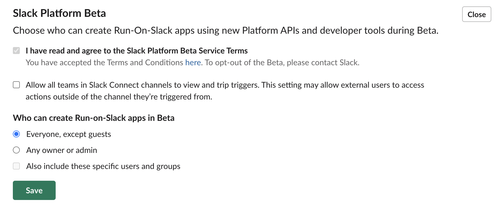

# Getting started BETA

This guide will walk you through introducing you to the [next-generation platform](/bolt-js/future/getting-started#next-gen). It will also cover how to get started with your next-generation platform experience with Bolt for Javascript by setting up the Slack CLI and also installing the required dependencies.

---
### What is the next-generation platform? {#next-gen}

<ts-icon class="ts_icon_info_circle"></ts-icon>Our next generation platform is currently in beta. [Your feedback is most welcome](/bolt-js/future/feedback) - all feedback will help shape the future platform experience!

The next-generation platform is an exciting new way to develop apps for Slack! It is focused on 2 components:
1. **Flexible functionality**: You can now create modular, shareable, and remixable building blocks within your apps that make it easier than ever to connect and reuse functionlity. The primary components of this new functionality are [built-in](/bolt-js/future/built-in-functions) and [custom functions](/bolt-js/future/custom-functions), [workflows](/bolt-js/future/workflows), and [triggers](/bolt-js/future/triggers).
2. **Quick setup**: With our next-generation developer tools, you can quickly build secure, scalable apps. One of the tools is the [Slack CLI](https://api.slack.com/future/tools/cli), which allows faster development by allowing you to create and scaffold apps all from the command line. Another tool are [app manifests](/bolt-js/future/app-manifests), which are configuration files for your apps that can be shared and reused to quickly set up applications.

#### Limitations

Currently for Bolt JS, you can only create remote functions and apps which can be hosted on third party infrastructure (such as [Heroku](https://www.heroku.com/)). Next-generation applications not built on Bolt frameworks (such as those built on [Deno](https://deno.land/)) can support non-remote functions and apps, meaning you can deploy them to secure and managed Slack infrastructure. Additionally, Bolt apps built on the next-generation platform currently do not support [Datastores](https://api.slack.com/future/datastores) that are hosted on Slack infrastructure.

If you'd like to use non-remote functionality as well as Slack infrastructure Datastores, consider building your next-generation application with Deno. You can get started with that [here](https://api.slack.com/future/get-started).

---

### Setting up the CLI {#setting-up-cli}

To build a next-generation app with Bolt for Javascript, you'll first need to get the Slack CLI set up on your machine. You can follow the [Quickstart Guide](https://api.slack.com/future/quickstart) to get instructions on how to manually or automatically install it based on your operating system. 

Since we won't be using Deno to build or migrate our next-generation app, you can skip any instructions related to installing Deno or creating an app using a Deno template. Once you've logged into the CLI using `slack login` and verified your login using `slack auth list`, you can proceed with the instructions in this guide.

> 💡 When logging into a workspace using the CLI, we recommend using a workspace where you won't disrupt real work getting done. Currently the new Slack Platform beta is only available for workspaces on a paid plan.

---

### Install dependencies {#install-dependencies}

Once the CLI is set up, make sure your machine has the most recent version of [Node](https://nodejs.org/en/) installed. Depending on what operating system your machine uses, you can either install Node through a package manager (such as [Homebrew](https://brew.sh/) for Mac) or directly from the website.

---

### Accept the Beta Terms of Service {#accept-tos}

In order to use the next-generation platform features, you'll need to accept a Terms of Service for Slack Platform Beta. To do so, go to the Workspace Settings of the workspace you'll be developing with, then go to the Permissions tab. Find the "Slack Platform Beta" heading, then select the checkbox that says "I have read and agree to the Slack Platform Beta Service Terms" and save the section. Once you have accepted, the section will look like this:

> 💡 You must be an admin of your workspace to be able to access the Workspace Settings and accept the Terms of Service.

---
### Next steps {#next-steps}

Congratulations! You're now ready to start building using the [next-generation platform](/bolt-js/future/getting-started#next-gen). 🎉 You can now proceed with either [creating a new app](/bolt-js/future/create-new-app) or [migrating an existing app](/bolt-js/future/migrate-existing-app).

