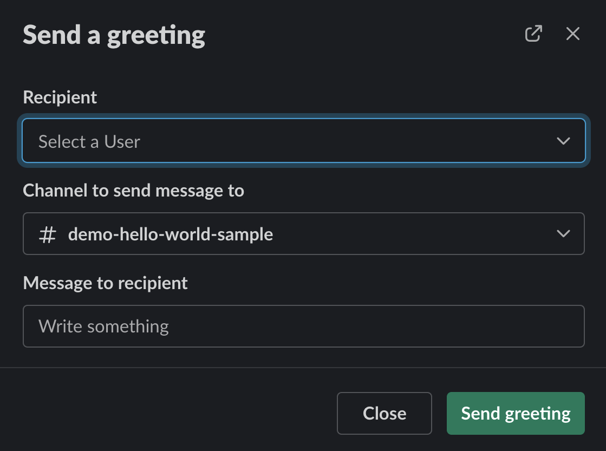
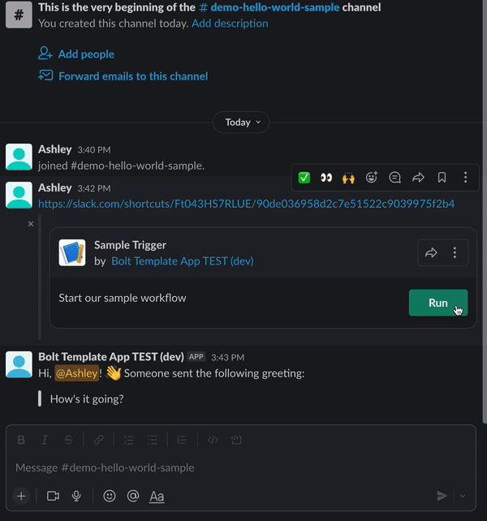

# Getting started <span class="label-beta">BETA</span>

<div class="section-content">
This guide will walk you through introducing you to the [next-generation platform](/bolt-js/future/getting-started#next-gen). It will also cover how to get started with your next-gen platform experience with Bolt for Javascript by setting up the Slack CLI and also installing the required dependencies.
</div>

---
### What is the next-generation platform? {#next-gen}

<p class="alert alert_info"><ts-icon class="ts_icon_info_circle"></ts-icon>Our next-generation platform is currently in beta. [Your feedback is most welcome](/bolt-js/future/feedback) - all feedback will help shape the future platform experience!</p>

The next-generation platform is an exciting new way to develop apps for Slack! It is focused on 2 components:
1. **Flexible functionality**: You can now create modular, shareable, and remixable building blocks within your apps that make it easier than ever to connect and reuse functionlity. The primary components of this new functionality are [built-in](/bolt-js/future/built-in-functions) and [custom functions](/bolt-js/future/custom-functions), [workflows](/bolt-js/future/workflows), and [triggers](/bolt-js/future/triggers).
2. **Quick setup**: With our next-generation developer tools, you can quickly build secure, scalable apps. One of the tools is the [Slack CLI](https://api.slack.com/future/tools/cli), which allows faster development by allowing you to create and scaffold apps all from the command line. Another tool are [app manifests](/bolt-js/future/app-manifests), which are configuration files for your apps that can be shared and reused to quickly set up applications.

#### Limitations

Today, Bolt for Javascript supports app development using next-gen platform features like Functions and Workflows and tools such as the Slack CLI alongside all current generally available Slack Platform features.

We do not yet support deployment to secure and managed Slack infrastructure or Datastores API [Datastores](https://api.slack.com/future/datastores) functionality.

If you'd like to deploy your app with Slack infrastructure, consider building your next-generation application with the Deno Slack API. You can get started with that [here](https://api.slack.com/future/get-started).

---

### Setting up the CLI {#setting-up-cli}

To build a next-generation app with Bolt for Javascript, you'll first need to get the Slack CLI set up on your machine. You can follow the [Quickstart Guide](https://api.slack.com/future/quickstart) to get instructions on how to manually or automatically install it based on your operating system. 

Since we won't be using Deno to build or migrate our next-generation app, you can skip any instructions related to installing Deno or creating an app using a Deno template. Once you've logged into the CLI using `slack login` and verified your login using `slack auth list`, you can proceed with the instructions in this guide.

> 💡 When logging into a workspace using the CLI, we recommend using a workspace where you won't disrupt real work getting done. Currently the new Slack Platform beta is only available for workspaces on a paid plan.

---

### Install dependencies {#install-dependencies}

Once the CLI is set up, make sure your machine has the most recent version of [Node](https://nodejs.org/en/) installed. Depending on what operating system your machine uses, you can either install Node through a package manager (such as [Homebrew](https://brew.sh/) for Mac) or directly from the website.

---

### Accept the Beta Terms of Service {#accept-tos}

In order to use the next-generation platform features, you'll need to accept a Terms of Service for Slack Platform Beta. To do so, go to the Workspace Settings of the workspace you'll be developing with, then go to the Permissions tab. Find the "Slack Platform Beta" heading, then select the checkbox that says "I have read and agree to the Slack Platform Beta Service Terms" and save the section. Once you have accepted, the section will look like this:


> 💡 You must be an admin of your workspace to be able to access the Workspace Settings and accept the Terms of Service.


Congratulations! You're now ready to start building using the [next-generation Platform](/bolt-js/future/getting-started#next-gen). 🎉 You can now proceed with either creating a new app by following the instructions below or [migrating an existing app](/bolt-js/future/migrate-existing-app).

---

### Create a new app {#create-app}

Before you start developing with Bolt, you'll want to create a Slack app. 

To create the app, you'll run the following command:
```
slack create my-app -t slack-samples/bolt-js-starter-template -b future
```
This command creates an app through the CLI by cloning a specified template. In this case, the template is the [Bolt for JavaScript Starter Template](https://github.com/slack-samples/bolt-js-starter-template/tree/future) on the `future` branch. This starter template includes a "Hello World" example that demonstrates how to use [built-in](/bolt-js/future/built-in-functions) and [custom](/bolt-js/future/custom-functions) Functions, [Triggers](/bolt-js/future/triggers), and [Workflows](/bolt-js/future/workflows).

The application will take a few moments to set up and clone the repository. Once the app is successfully created, you should see a message like this:
```
✨ my-app successfully created

🧭 Explore your project's README.md for documentation and code samples, and at any time run slack help to display a list of available commands

🧑‍🚀 Follow the steps below to try out your new project

1️⃣  Change into your project directory with: cd my-app

2️⃣  Develop locally and see changes in real-time with: slack run

3️⃣  When you're ready to deploy for production use: slack deploy

🔔 If you leave the workspace, you won’t be able to manage any apps you’ve deployed to it. Apps you deploy will belong to the workspace even if you leave the workspace
```

Your app has now been created in the `my-app` directory! This application can be used as a template for you to build your own next-generation Bolt for Javascript app with. However, if you'd like to test the "Hello World" example included in your template, read on! 📖

---
### Set up your trigger {#setup-trigger}

As mentioned, this app comes with pre-existing functionality - it uses Functions, Workflows and a Trigger set up to kick things off. Let's run a command to initialize that Trigger via the CLI.

First, make sure you're in the project directory in your command line: `cd my-app`

Then, run the following command to create a Trigger:
```
slack triggers create --trigger-def "triggers/hello-world-trigger.json"      
```

The above command will create a trigger for the selected workspace. Make sure to select the workspace you want and that it is appended by `(dev)`. This will create a dev instance of your app. Once the trigger is successfully created, you should see an output like this:

```
⚡ Trigger created
   Trigger ID:   [ID]
   Trigger Type: shortcut
   Trigger Name: Take Your Time
   URL: https://slack.com/shortcuts/[ID]/[Some ID]
```
The provided URL will be what you use to run your Trigger. Copy this URL and save it somewhere; you'll need it for later.

---
### Run your app {#run-your-app}

Now that your app and Trigger are successfully created, let's try running it!

Run `slack run` to start up the app. Executing `slack run` starts a local development server, syncing changes to your workspace's development version of your app.

You'll be prompted to select a workspace to install the app to&mdash;select the development instance of your workspace (you'll know it's the development version because the name has the string `(dev)` appended).

> 💡 If you don't see the workspace you'd like to use in the list, you can `CTRL + C` out of the `slack run` command and run `slack auth login`. This will allow you to authenticate in your desired workspace to have it show up in the list for `slack run`.

Once the app is successfully run, you'll see output in your Terminal to indicate it's running, similar to what you would see with any other Bolt for JavaScript app. You can search for the `⚡️ Bolt app is running! ⚡️` message to make sure that your app has successfully started up.

### Trigger your app's workflow {#trigger-workflow}

With your app running, access your workspace and paste the URL from the the Trigger you created in the previous step into a message in a public channel.

> 💡 To make the trigger URL more widely accessible, we recommend saving the Trigger as a channel bookmark for easy access.

Send the message and click the "Run" button that appears. A modal will appear prompting you to enter information to greet someone in your Slack workspace. Fill out the requested information.



Then, submit the form. In the specified channel submitted in the form, you should receive a message from the app tagging the submitted user. The message will also contain a randomly generated greeting and the message you wrote in the form..

The full app flow can be seen here:


---

### Next steps {#next-steps}

Now we have a working instance of a next-generation app in your workspace and you've seen it in action! You can explore on your own and dive into the code yourself here or continue your learning journey by diving into [App Manifests](/bolt-js/future/app-manifests) or looking into adding more [Functions](/bolt-js/future/built-in-functions), [Workflows](/bolt-js/future/workflows), and [Triggers]() to your app!

