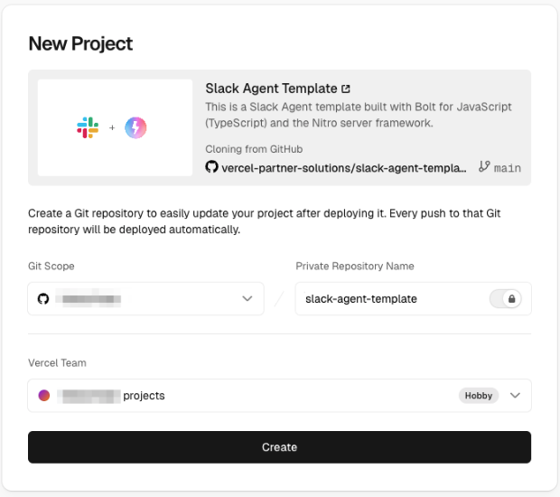
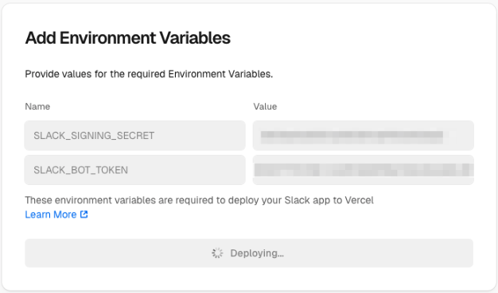

# Deploying to Vercel

This guide walks you through preparing and deploying a Slack app using Bolt for JavaScript, [Workflow DevKit's](https://useworkflow.dev/) `DurableAgent`, [AI SDK](https://ai-sdk.dev/) tools, the [Nitro](https://nitro.build/) server framework, and [Vercel](https://vercel.com/home).

When you’re finished, you’ll have this ⚡️[Slack agent template](https://github.com/vercel-partner-solutions/slack-agent-template) to run, modify, and make your own.

---

## Prerequisites

First things first, take a few moments to set up the following: 

* Make sure you have a development environment where you have permission to install apps. You can get a free sandbox with the [Slack Developer Program](https://api.slack.com/developer-program). 
* Ensure you have an account with a Git provider (GitHub, GitLab, or Bitbucket).

## Create a new Vercel project

Create a new Vercel project based on a Bolt for JavaScript template by clicking the button below.

<Button label="Deploy with Vercel" link="https://vercel.com/new/clone?demo-description=This+is+a+Slack+Agent+template+built+with+Bolt+for+JavaScript+%28TypeScript%29+and+the+Nitro+server+framework.&demo-image=%2F%2Fimages.ctfassets.net%2Fe5382hct74si%2FSs9t7RkKlPtProrbDhZFM%2F0d11b9095ecf84c87a68fbdef6f12ad1%2FFrame__1_.png&demo-title=Slack+Agent+Template&demo-url=https%3A%2F%2Fgithub.com%2Fvercel-partner-solutions%2Fslack-agent-template&env=SLACK_SIGNING_SECRET%2CSLACK_BOT_TOKEN&envDescription=These+environment+variables+are+required+to+deploy+your+Slack+app+to+Vercel&envLink=https%3A%2F%2Fapi.slack.com%2Fapps&from=templates&project-name=Slack+Agent+Template&project-names=Comma+separated+list+of+project+names%2Cto+match+the+root-directories&repository-name=slack-agent-template&repository-url=https%3A%2F%2Fgithub.com%2Fvercel-partner-solutions%2Fslack-agent-template&root-directories=List+of+directory+paths+for+the+directories+to+clone+into+projects&skippable-integrations=1&teamSlug=vercel-partner-demo" />

You will then be prompted to select a Git provider. Select your preferred provider and log in. 



Select your provider as the Git Scope and rename the repo if you'd like. Click **Create**.

Keep this browser tab open; we'll be back to it soon. Next, we'll need to add a couple of variables for our app. To obtain these, direct your attention to the Slack app settings page. 

## Create a Slack app

Create a new Slack app through [this link](https://api.slack.com/apps?new_app=1), then select **from a manifest**. Next, choose a workspace you have permission to install apps in. Click **Next**, then copy and paste the project manifest code here, replacing the placeholder text in the **JSON** tab.

```js reference
https://github.com/vercel-partner-solutions/slack-agent-template/blob/main/manifest.json
```

Click **Next** and then **Create**.

## Install app

Still in the app settings, navigate to the **Install App** section and click the button to install your app to the workspace. After installing the app, a bot token will be available. Copy this token and paste it in the Vercel setup where it says `SLACK_BOT_TOKEN`.

Back in the Slack app settings, navigate to the **Basic Information** section and find the **Signing Secret**. Copy this token and paste it in the Vercel setup where it says `SLACK_SIGNING_SECRET`, then click **Deploy**.



The deployment process will kick off, and you'll receive progress updates. Be patient. Deployment is hard work! Once it's finished, you'll see a confirmation screen with a button to **Continue to Dashboard**. Click that button. Here you can see that your app has been deployed! Use this dashboard to keep tabs on build logs, deployment checks, and more.

## Set AI Gateway token

Follow these steps to create an AI Gateway API key from the Vercel dashboard.
1. From the Vercel dashboard, click on the **AI Gateway** tab in the top nav bar.
2. On the left sidebar, select **API Keys**. 
3. Click **Create Key**, give it a name, and copy the value (it won't be shown again).

Once you have the key, you need to add it to your project so your code can use it. There are two primary ways to do this: through the dashboard and for local development.

Through the dashboard:
1. Go to your project in Vercel.
2. Click the **Settings** tab in the top nav bar.
3. Select **Environment Variables** from the left-hand menu.
4. Select **Add Environment Variable** to add a variable with the `Key` set to `AI_GATEWAY_API_KEY` and the `Value` set to the key value you just copied.
5. Click **Save**. Redeploy your app for these changes to take effect.

For local development, open your terminal and set the environment variable `AI_GATEWAY_API_KEY` to the value of the key you copied.

```sh
export AI_GATEWAY_API_KEY=<your-key-here>
```

## Update URLs

Once the deployment has completed, navigate back to the Slack [app settings](https://api.slack.com/apps) and open the **App Manifest** from the sidebar. 

Update the manifest so that all of the `reference_url` and `url` fields use your domain. Here are some examples:
* **Slash commands URL**: `https://slack-agent-template-example.vercel.app/api/slack/events`
* **Event subscriptions**: `https://slack-agent-template-example.vercel.app/api/slack/events`
* **Interactivity request URL**: `https://slack-agent-template-example.vercel.app/api/slack/events`

Click **Save** and verify the URL.

## Run the app

Open your Slack workspace and add your new app to a channel. Your app should respond whenever it is tagged in a message or sent a DM!

Your app is now set up to build and deploy whenever you commit to your repo.

## Next steps

✨ Explore Vercel documentation [here](https://vercel.com/docs/git).

✨ Learn all about [developing apps with AI features](/ai/developing-ai-apps).