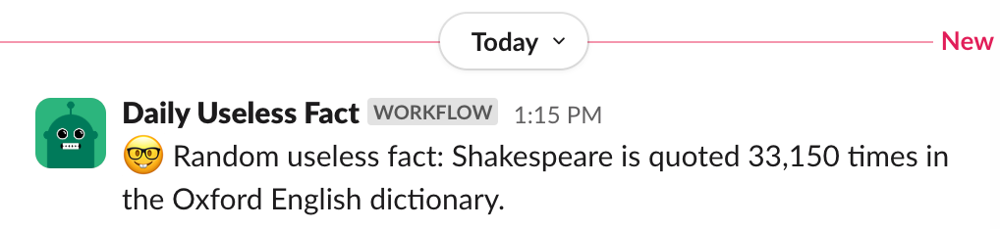
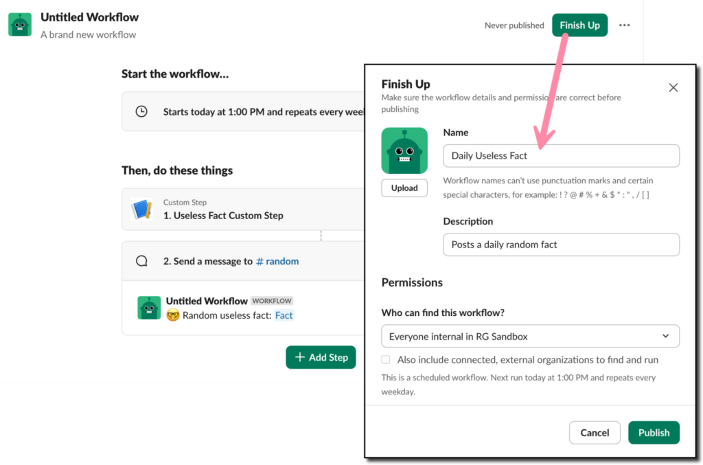

In this tutorial, we’ll create a workflow that fetches data from a third-party API and sends a formatted message to a Slack channel with the results. We’ll use the [random useless facts API](https://uselessfacts.jsph.pl/) to post a daily fact to a Slack channel. You’ll also learn how to use the [Bolt for JavaScript](/tools/bolt-js) framework to add custom steps that can be used in Workflow Builder, the no-code workflow tool in Slack.



## Create your new Slack app

All apps built for Slack have an [app manifest](/app-manifests). This is the configuration for the app, such as the name, settings, and required permissions. The app manifest also describes any functions (custom steps) your app will make available to your Slack workspace. We'll create an app from the manifest shown below.

First, log in to your Slack workspace or [join the Developer Program](https://api.slack.com/developer-program/join) to get a free enterprise sandbox. [Create a new app](https://api.slack.com/apps/new), then, choose **From a manifest**. Follow the prompts, copying and pasting the manifest contents below in the JSON tab, replacing the placeholder text that is there. 

```json
{
  "display_information": {
    "name": "Useless Fact App"
  },
  "features": {
    "app_home": {
      "home_tab_enabled": true,
      "messages_tab_enabled": true,
      "messages_tab_read_only_enabled": true
    },
    "bot_user": {
      "display_name": "Useless Fact App",
      "always_online": false
    }
  },
  "oauth_config": {
    "scopes": {
      "bot": [
        "chat:write",
        "app_mentions:read",
        "workflow.steps:execute"
      ]
    }
  },
  "settings": {
    "event_subscriptions": {
      "user_events": [
        "message.app_home"
      ],
      "bot_events": [
        "app_mention",
        "workflow_step_execute",
        "function_executed"
      ]
    },
    "interactivity": {
      "is_enabled": true
    },
    "org_deploy_enabled": true,
    "socket_mode_enabled": true,
    "token_rotation_enabled": false,
    "function_runtime": "remote"
  },
  "functions": {
    "useless_fact_step": {
      "title": "Useless Fact Custom Step",
      "description": "Runs useless fact step",
      "input_parameters": {},
      "output_parameters": {
        "message": {
          "type": "string",
          "title": "Fact",
          "description": "A random useless fact",
          "is_required": true,
          "name": "message"
        }
      }
    }
  }
}
```

Note the app manifest includes a function named `useless_fact_step` and declares the function returns one value named “Fact” as its output. We'll get to this later.

### Save tokens

Once your app has been created, scroll down to **App-Level Tokens** on the **Basic Information** page and create a token that requests the [`connections:write`](/reference/scopes/connections.write) scope. This token will allow you to use [Socket Mode](/apis/events-api/using-socket-mode), which is a secure way to develop on Slack through the use of WebSockets. Save the value of your app token and store it in a safe place. We’ll use these later.

### Install app in workspace

Still in the app settings, navigate to the **Install App** page in the left sidebar. Install your app. When you press **Allow**, this means you’re agreeing to install your app with the permissions that it’s requesting. Copy the bot token that you receive and store it in a safe place for subsequent steps.

Now that you’ve completed the app setup, it’s time to write some code!

### Install Node and set up the project

Open your terminal or command prompt. First, check to see that you have Node.js installed and it is a recent long-term support (LTS) version by typing the following command.

```sh
node -v
```

If you get an error or if it’s an older version than what’s available for download on the [Node.js website](https://nodejs.org/), take a moment to install the latest version.

Next, create a new directory for the project named `useless-fact-app` and change to the new directory.

```sh
mkdir useless-fact-app
cd useless-fact-app
```

For Windows, the command looks like this:

```powershell
md useless-fact-app
```

In your terminal window, run the following command to clone the starter template repository locally:

```bash
# Clone this project onto your machine
git clone https://github.com/slack-samples/bolt-js-starter-template.git .
```

Open the project in VS Code or your favorite code editor. Rename the `.env.sample` file to `.env`. Open the file and paste the following, replacing the placeholders with the values you saved earlier. 

```txt
SLACK_BOT_TOKEN={your-bot-token-xoxb-1234}
SLACK_APP_TOKEN={your-app-token-xapp-1234}
```

### Add function code

Replace the contents of the `app.js` with the code shown here.

```js
import bolt from "@slack/bolt";
import "dotenv/config";

const { App } = bolt;

// Initialize the Bolt app
const app = new App({
  token: process.env.SLACK_BOT_TOKEN,
  appToken: process.env.SLACK_APP_TOKEN,
  socketMode: true,
});

// Make an API call to retrieve a random fact
async function getUselessFact() {
  const res = await fetch("https://uselessfacts.jsph.pl/api/v2/facts/random");
	  if (!res.ok) {
	    return null;
	  }
	  const data = await res.json();
	  return data;
}

// Define the function for Workflow Builder
app.function("useless_fact_step", async ({ complete, fail, logger }) => {
  try {
    app.logger.info("Running useless fact step...");

    // Get the fact using the API
    const fact = await getUselessFact();

    if (fact && fact.text) {
      // Use complete() to send results to Slack
      await complete({
        outputs: {
          message: fact.text,
        },
      });
    } else {
      // Use fail() to send an error to Slack
      await fail({ error: "There was an error retrieving a random useless fact :cry:" });
    }
  } catch (error) {
    // Log the error and send an error message back to Slack
    logger.error(error);
    await fail({ error: `There was an error 😥 : ${error}` })
    }
});

// Start the Bolt App!
async function main() {
  await app.start();
  app.logger.info("⚡️ Bolt app is running!");
}

main();
```

The code in the `app.js` file initializes the Bolt app using your tokens and enables Socket Mode. Next, it defines the `getUselessFact()` function that fetches a random fact. It uses the Bolt framework to create a Slack function named `useless_fact_step`. This is the same function we registered in the app manifest previously; the function's name, inputs, and outputs in the code must match with the what is defined in the app manifest. Finally, a function named `main()` is used to start the Bolt app.

## Run your Bolt app

From your terminal, enter the following command:

```sh
npm run dev
```

You should see the following printed to the console.

```sh
> bolt-useless-facts@0.1.0 dev

> node --env-file=.env --watch app.js

[INFO]  bolt-app ⚡️ Bolt app is running!
```

Your Bolt app is running, and you can now use it in your Slack workspace!

## Create a new workflow using Workflow Builder

To create a new workflow, open Workflow Builder in Slack using one of the following methods.

* **Use the message box:** In any channel, type `/workflow` and select **Create a workflow**.
* **Use the sidebar:** Navigate to the left sidebar in Slack and click **More**, then **Tools**, then **Workflows**. Click **+New** then **Build Workflow** to create a new workflow.

### Schedule the workflow

Every workflow starts with a trigger. For this workflow, it may make sense to have it scheduled for each work day at a specific time. 
1. Under **Start the workflow...**, click **Choose an event**.
2. From the list of events, click **On a schedule**.
3. Configure the schedule for your app to run. Under **Starts on**, choose today’s date. Change the time to 15 or 30 minutes from now (you can update the scheduled time and frequency after you verify it is working). Under **Frequency**, choose **Every weekday (Monday to Friday)**. Click **Continue**.

### Add the Bolt app's function to the workflow

After the workflow is triggered, the next step is to call the function in the Bolt app. This is done using a custom step.

1. Click **+ Add steps**.
2. Click **Search steps...**.
3. In the search box, start typing the name of your Bolt app.
4. Click **Useless Fact Custom Step**.
5. Click **Save**.

### Add a channel message step

After calling the Bolt app and retrieving a random fact, the next step is to send a message to a channel.

1. Click **+ Add Step**.
2. Click **Messages**, then **Send a message to a channel**.
3. Click **Select a channel** and choose a channel to send a message to.
4. Under **Add a message**, type something like `“🤓 Random useless fact:”`.
5. Click **{} Insert a variable** and then select **Fact** under **1. Useless Fact Custom Step**.
6. Click **Save**.

### Publish and test the workflow

Almost there! The final task is to publish the workflow and wait for the next scheduled run to see it in action!

1. Click **Finish Up**.
2. Enter a **Name**, such as `Daily Useless Fact`.
3. Update the **Description**.
4. Click **Publish**.



Wait for the scheduled time and see your new custom Bolt app in action!

### Make changes to the workflow

If needed, you can always make changes to elements of your workflow, such as the schedule, channel, or message. 

1. From the left sidebar in Slack, click **More**, then **Tools**, then **Workflows**. 
2. Find your workflow and click the three vertical dots on the right side.
3. Click **Edit workflow** and make changes. Don't forget to publish!

## Deploy your Bolt app

Congratulations! You’ve learned how to create a Bolt app using the [Bolt for JavaScript](/tools/bolt-js) framework and a daily scheduled workflow using [Workflow Builder](/workflows/workflow-builder)! 

The Bolt app will continue to work as long as you have it running on your computer. This is acceptable for development and testing purposes, but a better long-term solution is to deploy the application to a production environment. You can follow the guides available for [Deploying to AWS Lambda](/tools/bolt-js/deployments/aws-lambda/) or [Deploying to Heroku](/tools/bolt-js/deployments/heroku) for steps on deploying to those environments. Alternatively, you can deploy to any platform that supports JavaScript serverless functions or Node.js applications.